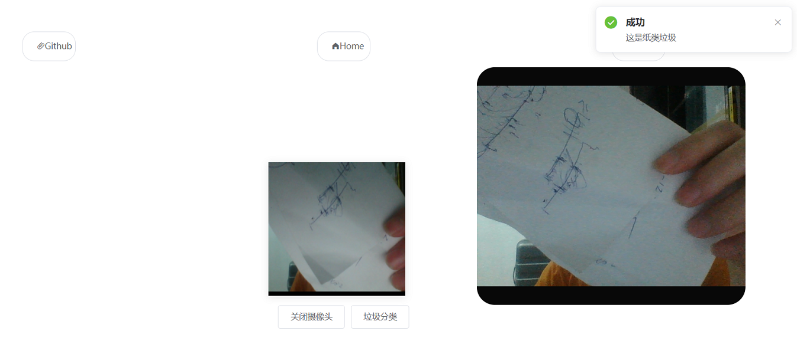

## 2基于神经网络的垃圾分类识别

一共六类垃圾

### 项目文件

项目文件列表如下：

1. `data`:存放训测试集，实时保存的图像（用于在线检测）。
2. `dist`:vue打包后的文件夹
3. `app.py`:flask运行文件
4. `model`:存放卷积网络模型(基于inceptionv3的fine-tunning),使用时解压后放在根目录

| 名称             | 参数                                                    |
| ---------------- | ------------------------------------------------------- |
| 操作系统         | win10                                                   |
| 系统位数         | 64位                                                    |
| 内存             | 12G                                                     |
| GPU              | GTX950M/CUDA9.0                                         |
| IDE和相关环境    | VScode/anconda                                          |
| 主要运行依赖环境 | Python3.5/keras2.2.3/tensorflow-gpu 1.12.0/flask/vue.js |

配置好以上参数:

​	`npm install serve` `serve -s dist`:安装vue运行的服务器(也可以用nginx)

​    `flask run `:运行flask

### 显示界面

/home:

/start:

### 参数设置

| 训练参数     | 数值                                                       |
| ------------ | ---------------------------------------------------------- |
| 激活函数     | Softmax,Relu                                               |
| 优化算法     | min-batch,N-Adam,ReduceLROnPlateau,Early stopping,drop out |
| 初始学习率   | 0.001                                                      |
| 最大迭代次数 | 3000                                                       |
| 损失函数     | Corss-Entropy                                              |
| Drop out     | 0.15                                                       |

### 使用方法

安装好环境后,直接运行`CallFrame.py`

若要重新训练模型，则运行`inception_version_train.py`

---

**算法:**垃圾分类识别迁移学习模型训练算法

---

**输入:**预训练权重$w_0$,

|          | model1 | model2 |
| -------- | ------ | ------ |
| loss     | 0.39   | 0.24   |
| acc      | 87%    | 91.67% |
| val_loss | 0.68   | 0.03   |
| val_acc  | 78%    | 100%   |
| epoch    | 126    | 1375   |

